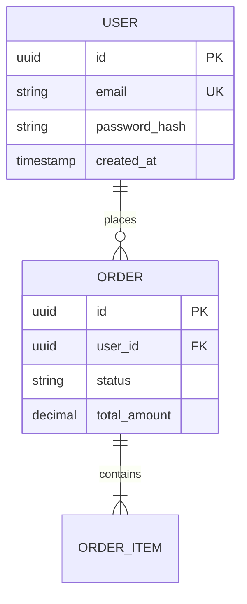
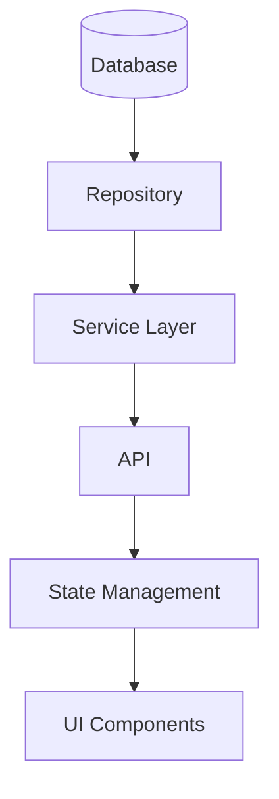

# ERD Documentation Generator Skill

Create comprehensive Entity Relationship Diagrams (ERDs) and data documentation for projects.

## When to Use

- Documenting existing database schemas
- Creating architecture documentation
- Analyzing data flows across layers
- Generating ERDs with Mermaid diagrams
- Understanding service layer DTOs and domain models

## Output Location

Save documentation to: `./docs/architecture/data-model.md`

## Discovery Phase

Before generating documentation, analyze the project:

### 1. Database Technology Detection
- **Prisma**: `prisma/schema.prisma`
- **TypeORM**: `*.entity.ts` with `@Entity` decorators
- **Sequelize**: `models/*.js` with `sequelize.define`
- **Mongoose**: `*.model.ts` with `mongoose.Schema`
- **Room**: `@Entity` and `@Dao` annotations (Android)
- **Django**: `models.py`
- **SQLAlchemy**: Python `Base.metadata`

### 2. Service Layer Patterns
- Repository pattern: `*.repository.ts`
- Service pattern: `*.service.ts`
- Controller pattern: `*.controller.ts`
- Use cases: `*.usecase.ts`

### 3. Frontend State Detection
- Redux: `createSlice`, `configureStore`
- Zustand: `create` from zustand
- Context API: `createContext`, `useContext`
- React Query: `useQuery`, `useMutation`

## Documentation Structure

```markdown
# Data Model Documentation

> Generated on: [DATE]
> Project: [PROJECT_NAME]
> Tech Stack: [AUTO-DETECTED]

## 1. Database Schema ERD

### Entity Relationship Diagram



### Table Definitions

#### [Table Name]
- **Purpose:** [Description]
- **Columns:** [List with types and constraints]
- **Indexes:** [List indexes]
- **Foreign Keys:** [List relationships]

---

## 2. Service Layer Models

### DTOs
- Request DTOs with validation rules
- Response DTOs with transformations

### Domain Models
- Business logic methods
- Invariants and rules

---

## 3. UI Data Structures

### Component Props
- TypeScript interfaces for components

### State Management
- Store structure and actions

### Form Schemas
- Validation rules

---

## 4. End-to-End Data Flow


```

## Key Deliverables

✅ Mermaid ERD with all entities and relationships
✅ Table definitions with columns, types, constraints
✅ Service layer DTOs and domain models
✅ UI data structures and state schemas
✅ End-to-end data flow diagrams
✅ Validation rules at each layer
